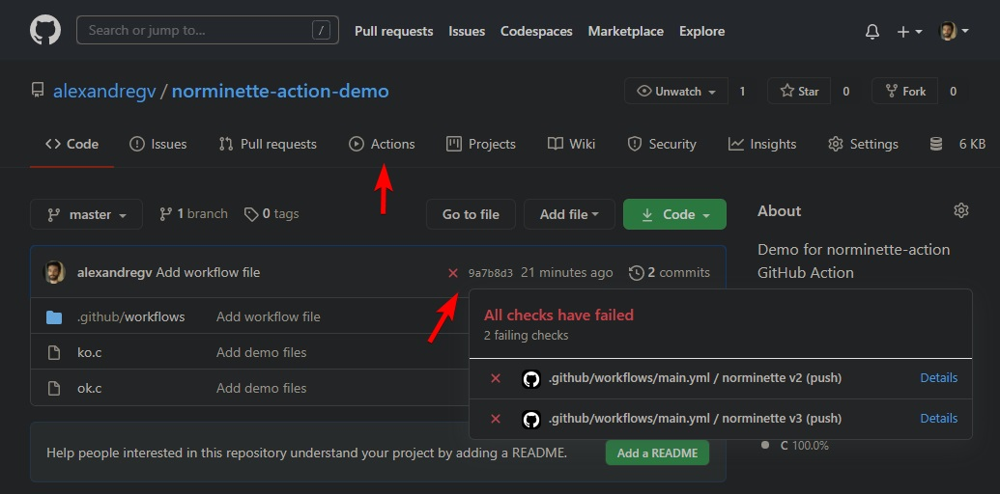

# norminette-action demo &middot; 

This is a simple demo for [norminette-action](https://github.com/alexandregv/norminette-action), a GitHub Action for 42School's norminette linter.

## Demo

You can see two C files, ok.c and ko.c, which are obviously a correct and incorrect file regarding to 42's Norm.  

The third and only important file is [.github/workflows/norminette.yml](.github/workflows/norminette.yml), which contains CI workflow.  
Here I defined two jobs, each for one version of the Norm. The only difference is `@v2`/`@v3` on lines [12](https://github.com/alexandregv/norminette-action-demo/blob/master/.github/workflows/norminette.yml#L12) and [19](https://github.com/alexandregv/norminette-action-demo/blob/master/.github/workflows/norminette.yml#L19).  

You can check CI results on each commit, or with the Actions button at the top of the repository.  
I also added a [badge](https://docs.github.com/en/free-pro-team@latest/actions/managing-workflow-runs/adding-a-workflow-status-badge) at the top of this README.

## See also

* [norminette-action](https://github.com/alexandregv/norminette-action) - The GitHub Action this repo demonstrates.
* [norminette-docker](https://github.com/alexandregv/norminette-docker) - A docker image for norminette. Used by this action.
* [norminette-vim](https://github.com/alexandregv/norminette-vim) - Vim integration for norminette. Displays norm errors directly inside Vim.

All of these are compatible with Norm version 2 and 3.
